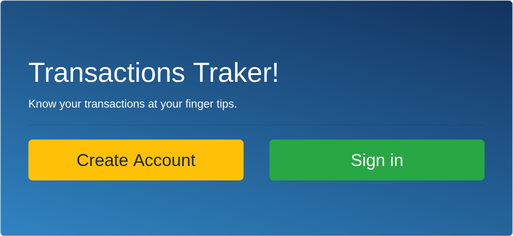

# Capstone Project Group our transactions

This is my Ruby on Rails Capstone Microverse Project a Group Transactions mobile application.

## Live Demo

[Live demo](https://murmuring-brushlands-49944.herokuapp.com/)

## About the project

- The group transactions project is one I have built following the needed requirements as described [here](https://www.notion.so/Group-our-transactions-ccea2b6642664540a70de9f30bdff4ce), where a user needs to sign up to login into the app to access the profile page with a menu showing his or her transactions.
- These transactions can have groups or not. Therefore a user can create a group and add a transaction to that group; or  a transaction can be created without selecting a group to fall under in case the user is not sure.
- Inside the app, there are many action buttons like "New Transaction", "New Group" that all take you to a forms to create a transaction or group.
- The app is fully functional and when a group is created, it is assigned an icon that will in turn be inherited by the transactions under that group. However, transactions without groups do not get to have an icon to them.
- The extra future in this app is the ability of the user to sneak peak and checkout other app users' total transactions amount and how they are using the app.
- My N+1 problem may have come form querying the database for grouped and non-grouped transactions. I however, managed to overcome this by creating scope methods in the Transaction model.

## How to run this project

- Install Ruby.
- Install Ruby on Rails.
- Install bundle.
- Run "bundle install" inside the folder.
- Run "rails server" inside folder.
- Go to localhost:3000/

## Test-driven development RSPEC

The code includes unit testing using RSpec. To start the test run `bundle exec rspec` in your terminal:

## Author

**Nakitto Catherine**
- Linkedin: [Nakitto Catherine](https://www.linkedin.com/in/nakitt-catherine2020)
- Github: [@Cathella](https://github.com/Cathella)
- Twitter: [@cathella9](https://twitter.com/cathella9)

## Show your support

Give a ⭐️ if you like this project!

## Enjoy!
